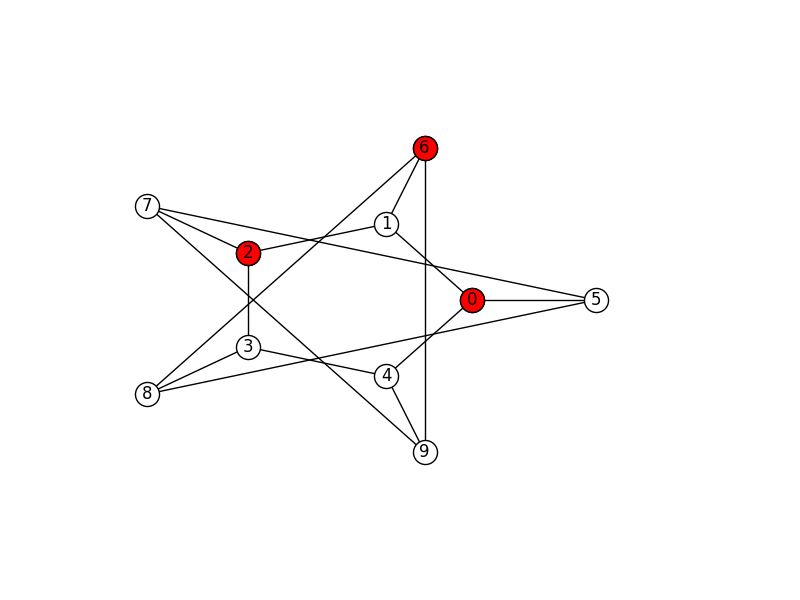
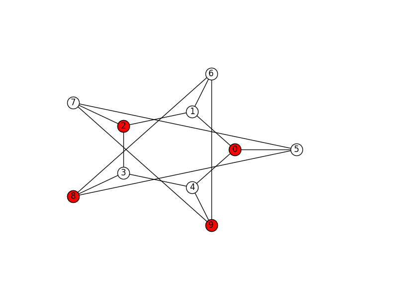
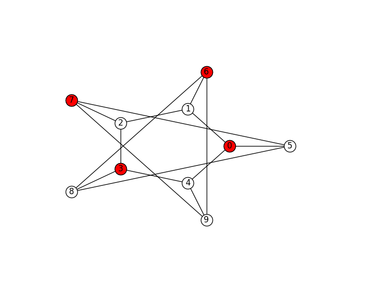

# Εύρεση Μέγιστων Ανεξάρτητων Υποσυνόλων ή Μακριά κι Αγαπημένοι

Μερικές φορές μας ενδιαφέρει για διάφορους λόγους να *ξεχωρίσουμε* ένα σύνολο οντοτήτων, ώστε να πάρουμε υποσύνολά του τέτοια ώστε τα μέλη των υποσυνόλων να μην έχουν σχέση μεταξύ τους. Αν απεικονίσουμε τις οντότητες και τις σχέσεις μεταξύ τους σε ένα γράφο, αυτό αντιστοιχεί στο να βρούμε υποσύνολα του γράφου ώστε τα μέλη του υποσυνόλου να μην είναι γείτονες μεταξύ τους. Ο μαθηματικός ορισμός είναι το *ανεξάρτητο σύνολο* (independent set): ένα σύνολο κόμβων ώστε κανένας δεν είναι γείτονας με έναν άλλο κόμβο στο σύνολο. Ένα ανεξάρτητο σύνολο ονομάζεται *μέγιστο ανεξάρτητο σύνολο* (maximal independent set) όταν  δεν είναι υποσύνολο κανενός άλλου ανεξάρτητου συνόλου. Με άλλα λόγια, δεν υπάρχει κόμβος έξω από το ανεξάρτητο σύνολο ο οποίος να μπορεί να ενταχθεί στο σύνολο και αυτό να παραμείνει ανεξάρτητο. 

Παρακάτω βλέπουμε τα δύο μέγιστα ανεξάρτητα σύνολα ενός γράφου άστρου.


Αντίστοιχα στη συνέχεια βλέπετε τα έξι μέγιστα ανεξάρτητα σύνολα ενός γράφου κύβου.


Τέλος, ακολουθούν και τρία μέγιστα ανεξάρτητα σύνολα του επονομαζόμενου γράφου Petersen με 10 κόμβους.



## Απαιτήσεις του Προγράμματος

Το πρόγραμμα θα καλείται ως εξής:
```
mis.py [-h] [-d] [-n NAME] [-f FIGURE] input
```

* Η παράμετρος `input` θα δίνει το όνομα του αρχείου που περιέχει τον γράφο. Το αρχείο θα περιέχει τον γράφο σε [networkx adjacency list format](https://networkx.github.io/documentation/networkx-1.10/reference/readwrite.adjlist.html).
* Αν δίνεται η παράμετρος `-d` θα εμφανίζονται στην οθόνη του υπολογιστή η γραφική απεικόνιση του γράφου και του κάθε συνόλου, όπως στις παραπάνω εικόνες της εκφώνησης.
* Αν δίνονται οι παράμετροι `-n ΝΑΜΕ` και `-f FIGURE` θα αποθηκεύεται κάθε εικόνα με το όνομα `NAME_x.FIGURE`. Για παράδειγμα αν έχουμε `-n cube -f png` θα αποθηκεύονται τα αρχεία `cube_0.png`, `cube_1.png`, κ.λπ.

1. Για να βρείτε τα ανεξάρτητα σύνολα ενός γράφου θα χρησιμοποιήσετε τον αλγόριθμο των Johson, Γιαννακάκη και Παπαδημητρίου, τον οποίο μπορείτε να βρείτε στο τέλος της εκφώνησης.
2. Δεν θα δίνονται διευκρινήσεις σχετικά με τη λειτουργία του αλγορίθμου. Σκοπός είναι να τον κατανοήσετε διαβάζοντας το άρθρο.
3. Μπορούν να δωθούν διευκρινήσεις σχετικά με κάποιους ορισμούς που δεν ξέρετε, όπως P, NP, και P = NP, που πάντως δεν είναι απαραίτητα για την υλοποίηση.
4. Για την ανάγνωση, τον χειρισμό, και την εμφάνιση των λύσεων μπορεί να χρησιμοποιηθεί η βιβλιοθήκη [networkx](https://networkx.github.io). Δεν θα δίνονται διευκρινήσεις για τη λειτουργία της βιβλιοθήκης, είστε ελεύθεροι να μελετήσετε την τεκμηρίωσή της.

Καλή Επιτυχία!

Βιβλιογραφία:

David S. Johnson, Mihalis Yannakakis, and Christos H. Papadimitriou: [On Generating All Maximal Independent Sets](generating_all_maximal_datasets.pdf). Information Processing Letters, 27, 119-123, 1988.


